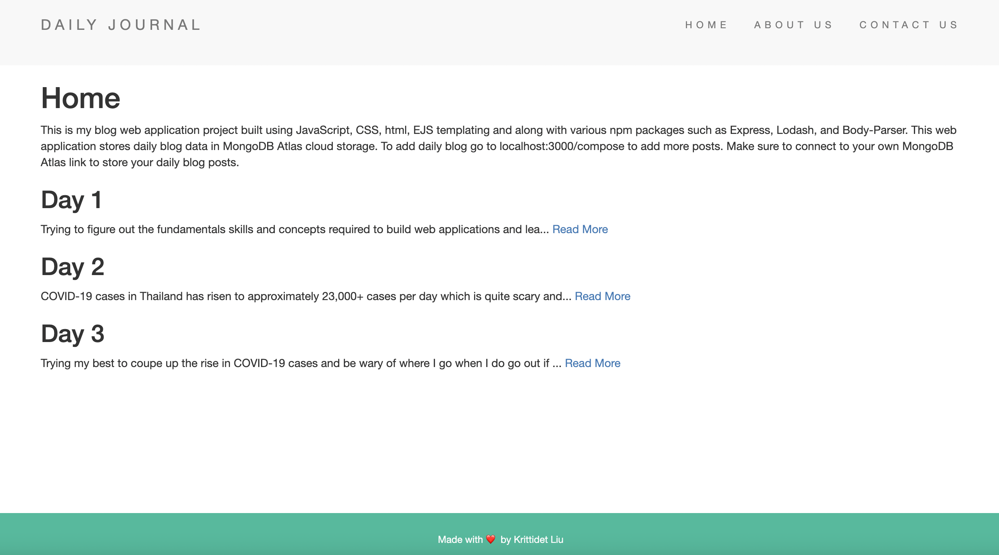

# Blog
 
This is my blog web application project built using JavaScript, CSS, html, EJS templating and along with various npm packages such as Express, Lodash, and Body-Parser. This web application stores daily blog data in MongoDB Atlas cloud storage. To add daily blog go to localhost:3000/compose to add more posts. Make sure to connect to your own MongoDB Atlas link to store your daily blog posts.

